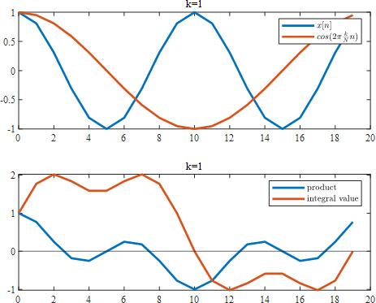
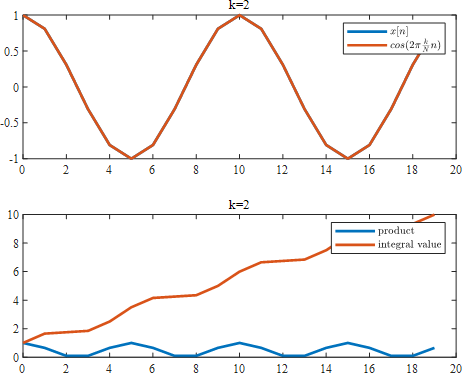
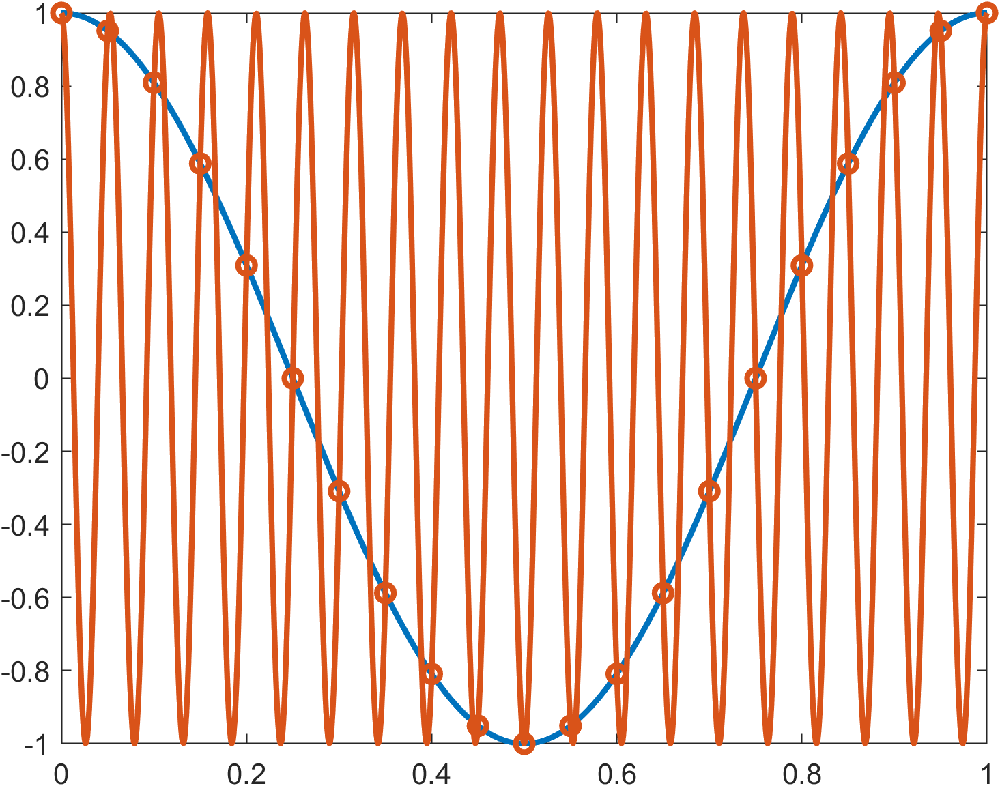
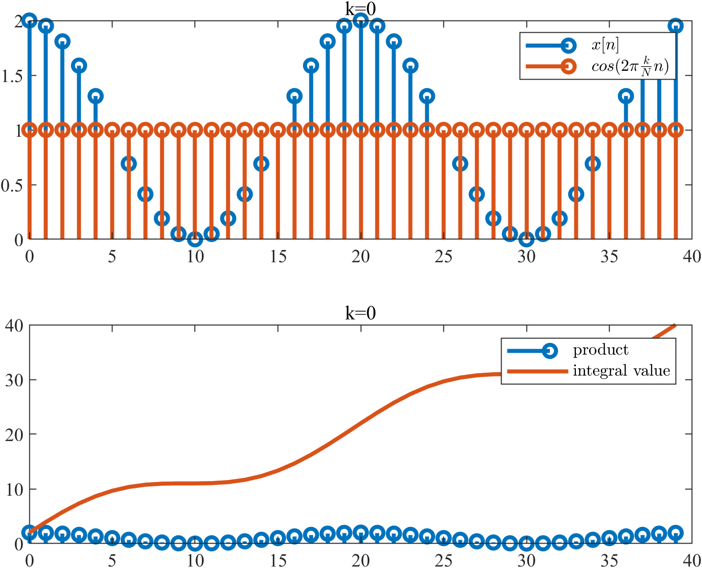
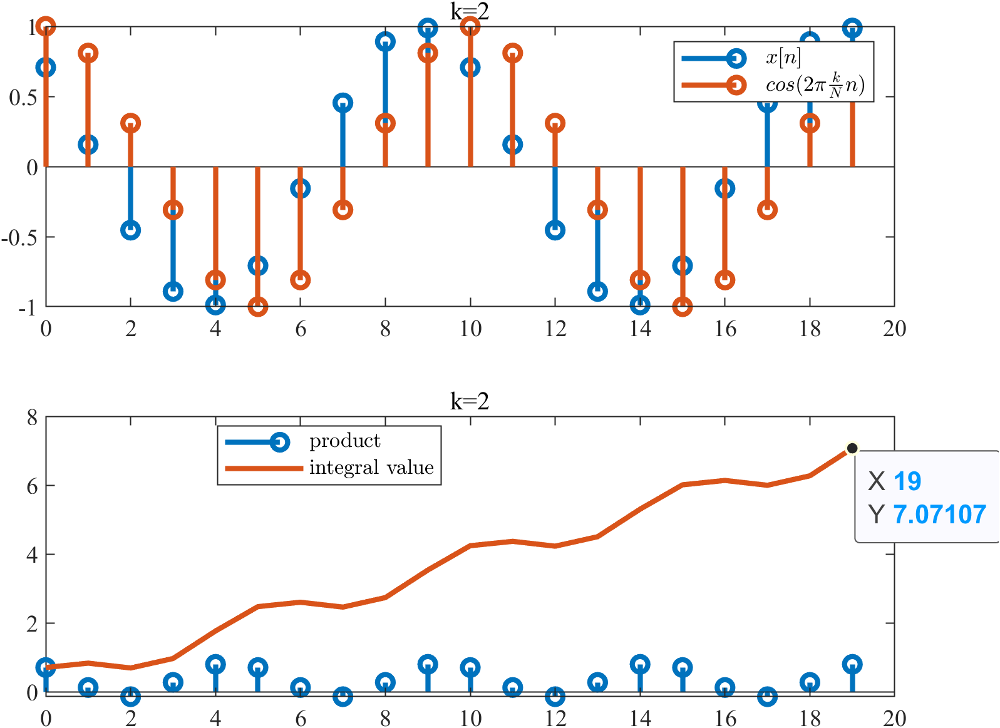
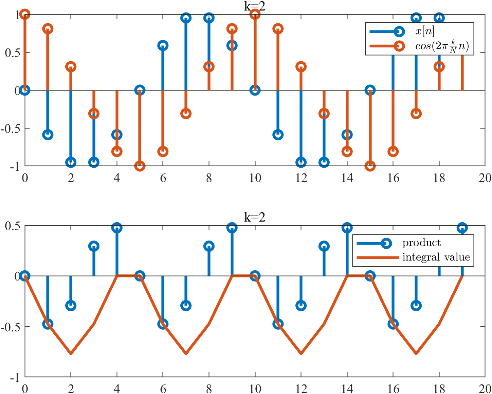
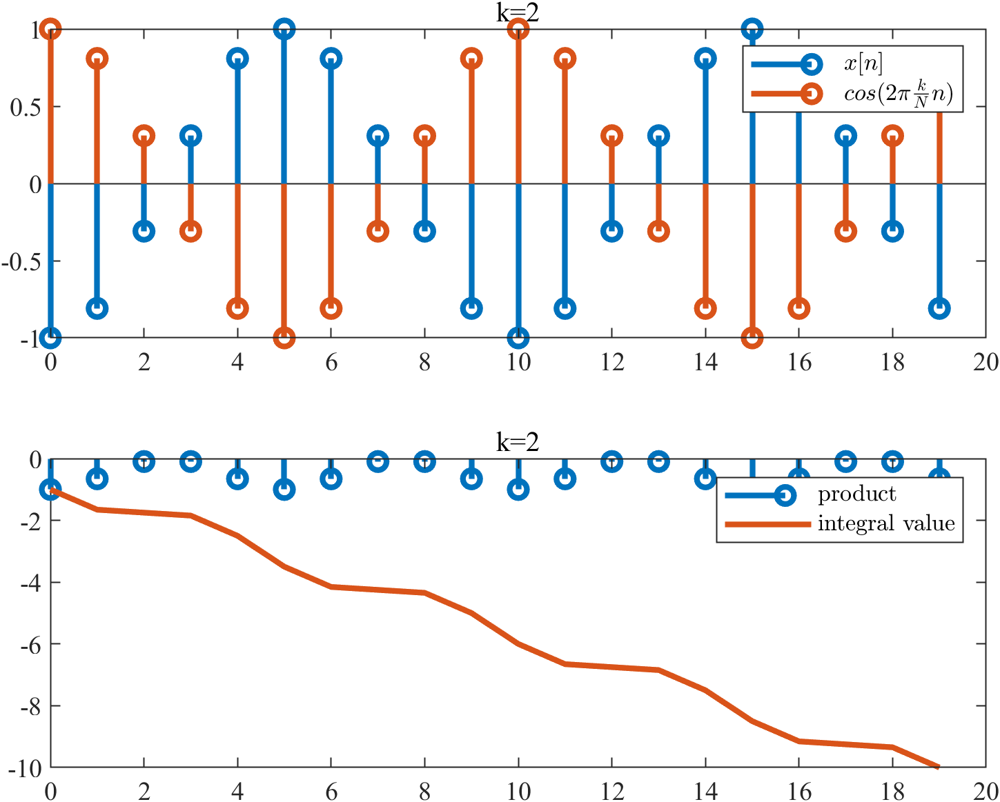
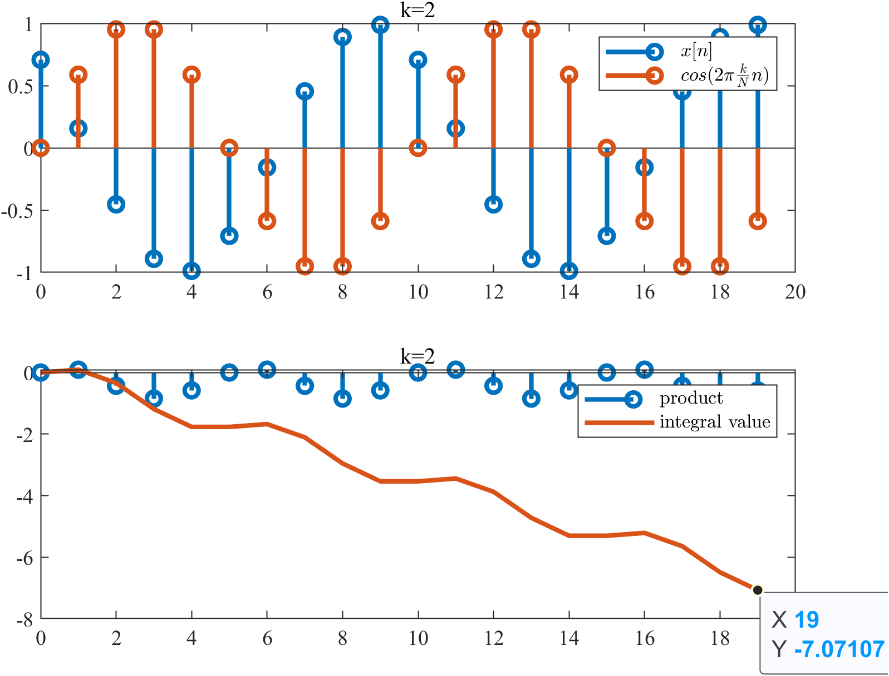
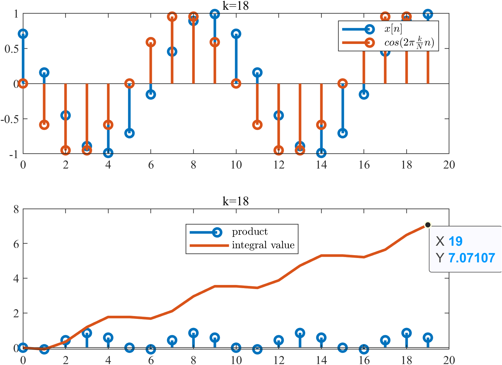

<!--
 * @Author: aMoonRunner jhshe@foxmail.com
 * @Date: 2023-10-18 20:41:00
 * @LastEditors: aMoonRunner jhshe@foxmail.com
 * @LastEditTime: 2023-10-20 11:35:28
 * @FilePath: \fourierTrans\README.md
 * @Description: 这是默认设置,请设置`customMade`, 打开koroFileHeader查看配置 进行设置: https://github.com/OBKoro1/koro1FileHeader/wiki/%E9%85%8D%E7%BD%AE
-->

# 傅里叶变换学习笔记

## 离散傅里叶变换

创建时间 _2023 年 10 月 18 日_

_纸上得来终觉浅，觉知此事要躬行，想搞懂离散傅里叶变换，最好是自己做一遍，回想起来，从来没有真正手算过傅里叶变换_

本文只求理解，会用，不追求严谨的推导

---

首先是离散傅里叶变换的公式，傅里叶变换后得到的$X[k]$为

$$
X[k]=\sum_{n=0}^{N-1}{x[n]e^{-j(2\pi/N)kn}},(0\leq k \leq N-1)
$$

然后是离散傅里叶**反**变换的公式，原信号$x(t)$的采样信号$x(n)$可以表示为

$$
x[n]=\frac{1}{N}\sum_{k=0}^{N-1}{X[k]e^{j(2\pi/N)kn}}
$$

---

对于$e^{-2\pi\frac{k}{N}n}$,如果不好理解，就根据欧拉公式$e^{i\theta}=cos(\theta)+isin(\theta)$先拆分一下，（最好是能够理解）

$$
X[k]=   \sum_{n=0}^{N-1}{x[n]cos(-2\pi k\frac{n}{N})}+
        j\sum_{n=0}^{N-1}{x[n]sin(-2\pi k\frac{n}{N})}
        ,(0\leq k \leq N-1)
$$

也就是

$$
X[k]=   \sum_{n=0}^{N-1}{x[n]cos(2\pi k\frac{n}{N})}-
        j\sum_{n=0}^{N-1}{x[n]sin(2\pi k\frac{n}{N})}
        ,(0\leq k \leq N-1)
$$

先看$cos$项，对于$X_{cos}[k]$，可以这样理解，在原信号的每个采样点$x[n]$所在的位置，按照某个特定频率的余弦信号也生成一个点（离散化），逐点相乘，再求和，这样可以寻找原始信号$x[n]$，与这个余弦信号$cos(2\pi\frac{k}{N}n)$之间的相关性

因为这个操作有个很奇妙的地方，如果这两个信号不相关，$X_{cos}[k]$算出来就是 0

举个例子，假设原信号$x(t)=cos(4\pi x)$,在两个周期内采样 20 个点
$$x[n]=cos(4\pi\times\frac{n}{N})$$

$X[1]$计算结果如下,$X_{cos}[1]=0$

$X[2]$计算结果如下,$X_{cos}[2]=10$

$X[3]$计算结果如下,$X_{cos}[3]=0$

一直到$X_{cos}[19]$,$X_{cos}[19]=0$

> 非常奇怪，k=19 与 k=1 的效果是一模一样的,这是因为根据$cos$的对称性$cos(\theta)=cos(2\pi-\theta)$ $$cos(2\pi\times k\frac{n}{N})=cos(2\pi\times(N-k)\frac{n}{N})$$
> 也可以这么理解，低频信号与高频信号是有交点的，$cos(2\pi\times 1t)$与$cos(2\pi\times 19t)$有很多交点，但是离散化之后，又恰巧把离散点取到了这些交点上，无法分辨这些点到底是哪条线上的，这也从另一个角度说明了为啥傅里叶变换是对称的，而且只有前面一半的是有用的，因为 k 取 19 时，无法判断到底时 1 触发的还是 19 触发的，干脆舍弃不用

只有当$x[n]$中有此频率成分时，$X_{cos}[k]$才不为 0，剩下的，积分算出来全是 0

那么，计算出来的$X_{cos}[k]$的物理含义到底是什么呢？

1. “$k$”表示第$k$个频率分量，这里，信号频率为 2Hz，采样频率$f_s$为 20Hz，那么$X_{cos}[k]$就对应了$f=\frac{k}{N}f_s$的频率，当$k=2$时，$f=2Hz$
   假设采样点数$N=40$，那么对于$$x[n]=cos(4\pi\times\frac{n}{N})$$进行变换，则$X_{cos}[2]=20$,对应频率$f=\frac{2}{40}\times40$
   k 对应的频率搞清楚了，那$X_{cos}[k]$的值表示什么呢？此频率分量真正的幅值为“$\frac{2}{N}X[k]$”,对于直流分量“$\frac{1}{N}X_{cos}[0]$”
   

至于“1/N,2/N”是怎么来的，看了有的教程，说太简单就不推导了，资质愚钝，不能理解

那么傅里叶变换中的$sin(\theta)$项又是啥意思呢

假设原始的函数有了相位偏移，$x(t)=cos(4\pi x+\pi/4)$,在两个周期内采样 20 个点
$$x[n]=cos(4\pi\times\frac{n}{N}+\frac{\pi}{4})$$

不相关的项$X[0],X[1],X[3]···$依然是 0，对于$X_{cos}[2],X_{cos}[18]$则有了变化

这个图像与原函数为$x(t)=0.707cos(4\pi x)$的效果是一样的，这种情况显然是不好的，无法分辨是本来原函数的幅值只有 0.707，还是因为相位的偏差导致算出来幅值为 0.707
甚至当相位偏了$\pi/2$时

相位偏了$\pi$时

也可以说上述只有 cos 的变换是不完善的，损失了某些信息，这就引入了 sin 项,用 cos 和 i\*sin 的组合，来不失真地进行转换

$X_{sin}[2]=-7.07$

$X_{sin}[18]=7.07$

 

> 注意，这里$X_{sin}[k]=-X_{sin}[N-k]$,也是因为根据$sin$的对称性$sin(\theta)=sin(2\pi-\theta)$ $$sin(2\pi\times k\frac{n}{N})=-sin(2\pi\times(N-k)\frac{n}{N})$$

这时，cos 项和 sin 项组合起来就能完整地表征原始信号了
幅值$$X[k]=\sqrt{(X_{cos}[k])^2+(X_{sin}[k])^2}$$
$$X[2]=\sqrt{(X_{cos}[2])^2+(X_{sin}[2])^2}=10$$
相位$$actan\frac{-(-0.707)}{0.707}=\pi/4$$
